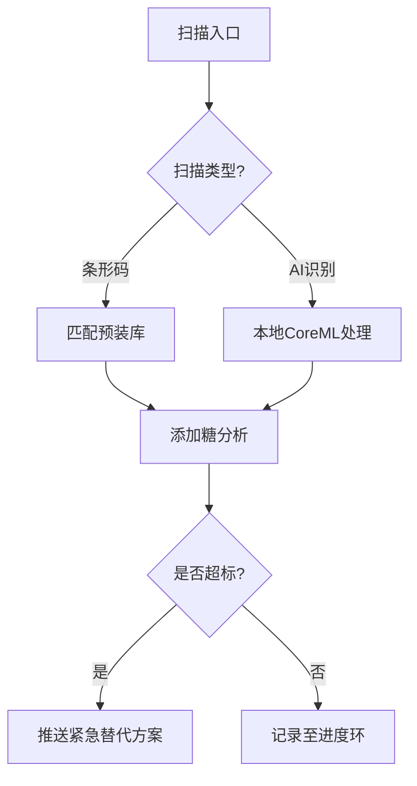

# Sugar Scope
---

# Masterplan: 控糖助手 (iOS 极简版)

```swift
// 架构核心原则
1. 隐私优先 → 数据不出设备
2. 零摩擦体验 → 匿名使用 + 3秒完成首次扫描
3. 中国本地化 → 预装库 + 中文AI模型
```

---

## 一、应用蓝图

### 1. 核心价值主张
- **一句话使命**：让控糖像扫码付款一样简单
- **关键指标**：  
  • 用户单日扫描次数 ≥3 → 习惯养成标志  
  • 替代方案点击率 ≥40% → 推荐有效性验证

### 2. 功能架构


---

## 二、技术实现

### 1. 技术栈
| 模块           | 方案                          | 选型理由                     |
|----------------|-----------------------------|----------------------------|
| **UI框架**     | SwiftUI + Combine           | 声明式开发 + 实时状态响应       |
| **数据库**     | Realm Swift (本地加密)       | 移动端优化 + 零配置同步        |
| **AI引擎**     | CoreML (ONNX转换模型)        | 离线运行 + 隐私保护           |
| **扫码**       | VisionKit                   | 原生支持 + 60fps流畅度        |
| **安全**       | Keychain Services           | 生物认证集成无缝化             |

### 2. 数据流设计
```plaintext
用户操作 → SwiftUI View → Combine Pipeline → 
Realm DB (本地) → CoreML处理 (设备内) → 
反馈UI更新 (主线程)
```

---

## 三、关键模块说明

### 1. 预装食品库
- **数据规模**：  
  • 初始版本：1200种中国常见食品（85%覆盖率）  
  • 每季度更新：通过App Store提交增量包（用户可选）  
- **数据结构**：  
  ```swift
  struct LocalFood: Object {
      @Persisted var barcode: String?  // 仅包装食品
      @Persisted var name_zh: String
      @Persisted var sugarType: SugarType  // enum: added/natural
      @Persisted var region: String = "CN"
  }
  ```

### 2. 匿名用户系统
- **设备指纹生成逻辑**：  
  ```swift
  // 基于不可变硬件特征哈希
  let fingerprint = UIDevice.current.identifierForVendor?.uuidString ?? ""
  let hashedID = SHA256.hash(data: Data(fingerprint.utf8))
  ```
- **数据生命周期**：  
  • 本地保留最近30天记录  
  • 导出CSV后自动清除历史数据（可选）  

### 3. CSV导出系统
- **筛选条件**：  
  ```swift
  struct ExportFilter {
      let startDate: Date
      let endDate: Date
      let sugarType: SugarType?  // 添加糖/自然糖
  }
  ```
- **文件格式样例**：  
  ```csv
  日期,食品名称,糖类型,摄入量(g),建议替代品
  2023-10-01,奶茶,添加糖,35,"乌龙茶+代糖"
  ```

---

## 四、开发里程碑

### Phase 1: MVP (6周)
| 目标                    | 交付物                      | 验收标准                     |
|-------------------------|---------------------------|----------------------------|
| 基础扫描闭环            | 条形码 → 预装库匹配          | 95%常见包装食品识别成功       |
| 核心UI完成              | 进度环 + 历史记录列表        | 60fps流畅滚动               |
| Realm架构搭建           | 数据模型 + 加密逻辑          | 通过Xcode Data Protection测试 |

### Phase 2: 智能升级 (4周)
| 目标                    | 交付项                      | 测试方法                    |
|-------------------------|---------------------------|---------------------------|
| CoreML集成              | 中国常见食品识别模型          | 测试集准确率 ≥80%           |
| 动态提醒系统            | 基于时间与行为的混合规则       | 触发准确率 ≥90%             |

### Phase 3: 数据自由 (2周)
| 目标                    | 技术点                      | 用户体验指标               |
|-------------------------|---------------------------|--------------------------|
| 时间范围导出            | Swift Charts数据聚合        | 导出耗时 <2秒 (万条记录)    |
| iCloud可选备份          | CloudKit轻量同步           | 冲突解决UI直观度 ≥8/10分   |

---

## 五、风险控制

### 1. 模型识别盲区
- **应对方案**：  
  • 用户纠错机制：长按记录提交修正 → 用于后续模型训练  
  • 模糊匹配：当置信度 <70%时显示相似结果  

### 2. 设备存储限制
- **优化策略**：  
  • 使用Realm的自动压缩功能  
  • 定期清理超过30天的记录（需用户确认）  

### 3. 用户留存挑战
- **游戏化设计**：  
  • "糖分预算"概念：每日分配额度可累积  
  • 解锁成就：连续7天达标 → 推送定制食谱（付费版）  

---

## 六、未来演进

### 1. 健康生态接入
```swift
// HealthKit集成预案
let healthStore = HKHealthStore()
let sugarType = HKQuantityType(.dietarySugar) 
healthStore.requestAuthorization(toShare: [sugarType], read: nil) { ... }
```

### 2. 商业模式扩展
- **B2B合作**：  
  • 低糖食品品牌赞助推荐位  
  • 超市合作：扫描商品码显示健康评分  

---
